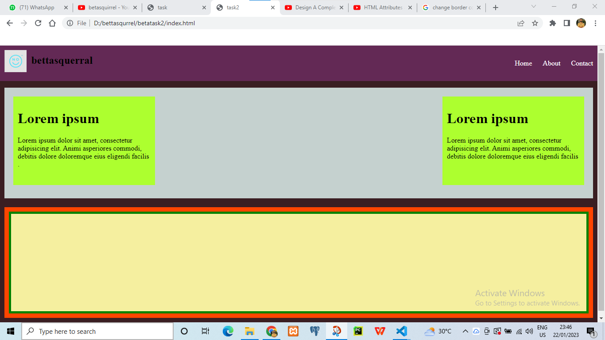
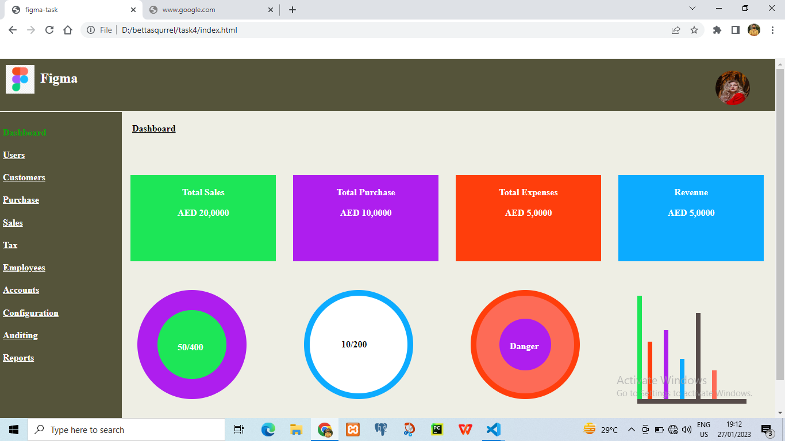

# betasqirrel-task

Assignments

[live](https://kpmakonics.github.io/betasqirrel-task/)

## Tasks

| Requirements                              | Output                        |
| ----------------------------------------- | ----------------------------- |
|  |  |
|  |  |
|  |  |

### Reading Tasks

- [Home](https://www.w3schools.com/html/default.asp)
- [Introduction](https://www.w3schools.com/html/html_intro.asp)
- [Editors](https://www.w3schools.com/html/html_editors.asp)
- [Basics](https://www.w3schools.com/html/html_basic.asp)
- [Elements](https://www.w3schools.com/html/html_elements.asp)
- [Attributes](https://www.w3schools.com/html/html_attributes.asp)
- [Headings](https://www.w3schools.com/html/html_headings.asp)
- [Paragraphs](https://www.w3schools.com/html/html_paragraphs.asp)
- [Styles](https://www.w3schools.com/html/html_styles.asp)
- [Formatting](https://www.w3schools.com/html/html_formatting.asp)
- [Quotations](https://www.w3schools.com/html/html_quotation_elements.asp)
- [Comments](https://www.w3schools.com/html/html_comments.asp)
- [Colors](https://www.w3schools.com/html/html_colors.asp)
- [CSS](https://www.w3schools.com/html/html_css.asp)
- [Links](https://www.w3schools.com/html/html_links.asp)
- [Images](https://www.w3schools.com/html/html_images.asp)
- [Classes](https://www.w3schools.com/html/html_classes.asp)
- [id](https://www.w3schools.com/html/html_id.asp)
- [favicon](https://www.w3schools.com/html/html_favicon.asp)
- [tables](https://www.w3schools.com/html/html_tables.asp)
- [borders](https://www.w3schools.com/html/html_table_borders.asp)
- [sizes](https://www.w3schools.com/html/html_table_sizes.asp)
- [headers](https://www.w3schools.com/html/html_table_headers.asp)
- [padding](https://www.w3schools.com/html/html_table_padding_spacing.asp)
- [colspan](https://www.w3schools.com/html/html_table_colspan_rowspan.asp)
- [styling](https://www.w3schools.com/html/html_table_styling.asp)
- [colgroup](https://www.w3schools.com/html/html_table_colgroup.asp)
