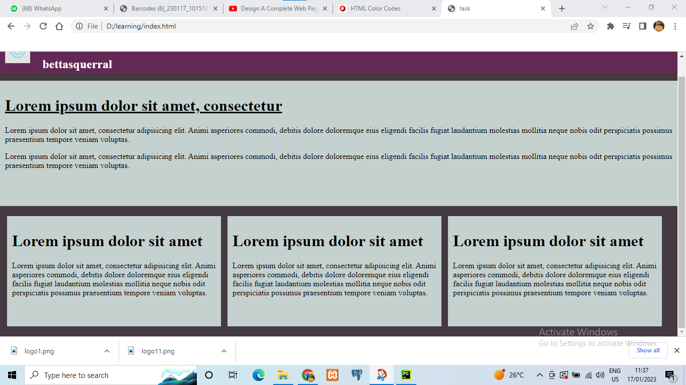
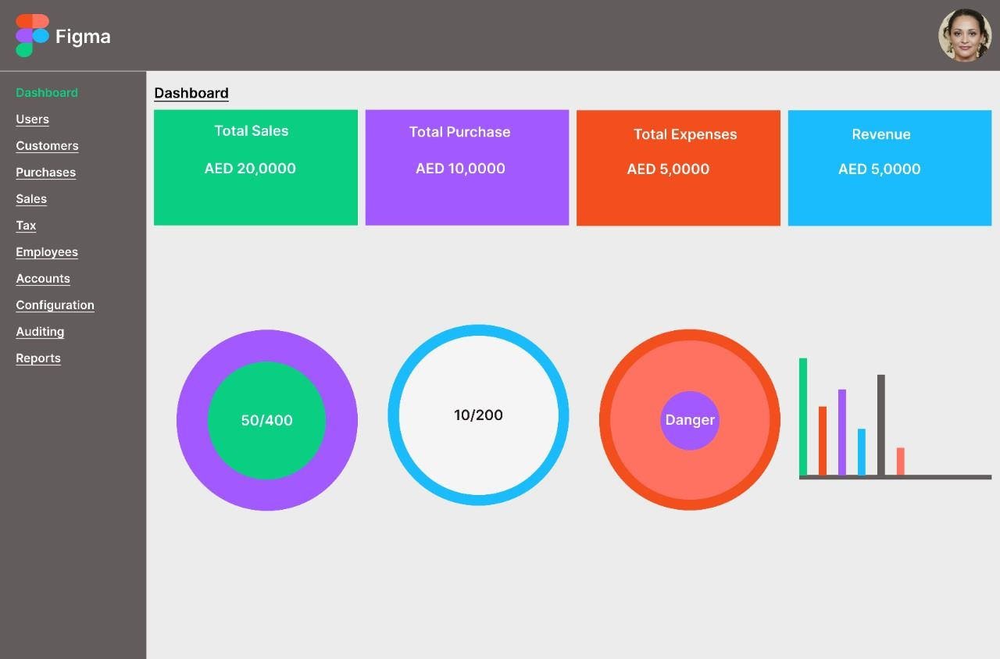

# betasqirrel-task

Assignments

## Tasks

| Requirements                       | Output                 |
| ---------------------------------- | ---------------------- |
|  |  |
|  |  |
|  |  |

### Reading rasks

- [Home](https://www.w3schools.com/html/default.asp)
- [Introduction](https://www.w3schools.com/html/html_intro.asp)
- [Editors](https://www.w3schools.com/html/html_editors.asp)
- [Basics](https://www.w3schools.com/html/html_basic.asp)
- [Elements](https://www.w3schools.com/html/html_elements.asp)
- [Attributes](https://www.w3schools.com/html/html_attributes.asp)
- [Headings](https://www.w3schools.com/html/html_headings.asp)
- [Paragraphs](https://www.w3schools.com/html/html_paragraphs.asp)
- [Styles](https://www.w3schools.com/html/html_styles.asp)
- [Formatting](https://www.w3schools.com/html/html_formatting.asp)
- [Quotations](https://www.w3schools.com/html/html_quotation_elements.asp)
- [Comments](https://www.w3schools.com/html/html_comments.asp)
- [Colors](https://www.w3schools.com/html/html_colors.asp)
- [CSS](https://www.w3schools.com/html/html_css.asp)
- [Links](https://www.w3schools.com/html/html_links.asp)
- [Images](https://www.w3schools.com/html/html_images.asp)
- [Classes](https://www.w3schools.com/html/html_classes.asp)
- [id](https://www.w3schools.com/html/html_id.asp)
